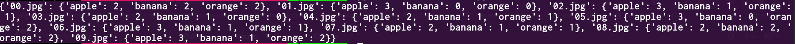

# **Fruit Detector** 

## Basic information
This is my Image Processing classes project from 5th semester.
This script distinguishes apples, oranges and bananas from pictures and counts them.
Project is based on OpenCV library. The photos are taken in similar conditions.
Results are printed on the terminal and written into *results.json* file.

Project tree structure:

## Results
Data printed on the terminal:

